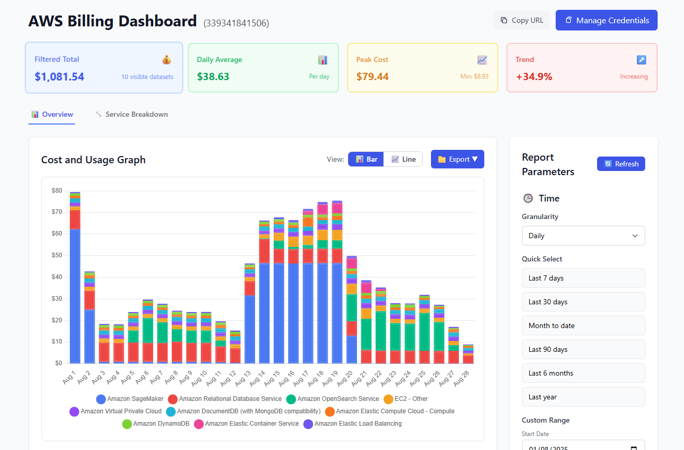

# AWS Billing Dashboard

A real-time AWS billing dashboard web application that tracks cloud usage and costs with comprehensive filtering and grouping capabilities.



I built this app because I was tired of constantly going into the AWS console just to check billing information. As the commit messages show, the entire project was generated using Claude Code. I’m using this as a way to explore Claude Code and learn how to use it more effectively.

## Features
- ✅ User-configurable AWS credentials (no server-side .env required)
- ✅ Stateless backend supporting multiple users
- ✅ AWS Cost Explorer API integration with real-time data
- ✅ Interactive Chart.js visualizations (bar/line charts)
- ✅ Advanced filtering and grouping by AWS dimensions
- ✅ Service breakdown analysis and cost rankings
- ✅ Data export functionality (CSV, JSON, reports)
- ✅ Docker containerization for easy deployment
- ✅ Responsive design with Tailwind CSS

## Quick Start (Docker - Recommended)

### Prerequisites
- Docker and Docker Compose
- AWS account with Cost Explorer API access

### Running with Docker

#### Option 1: Root Path Deployment (Default)

1. **Start the application:**
   ```bash
   docker compose up -d
   ```

2. **Access the application:**
   - Frontend: http://localhost:3000
   - Backend API: http://localhost:8000

#### Option 2: Sub-path Deployment

For reverse proxy setups (nginx, Apache, etc.) where you want to serve the app under a sub-path:

1. **Start the application with sub-path:**
   ```bash
   REACT_APP_BASE_PATH=/aws-billing docker compose up -d
   ```

2. **Access the application:**
   - Frontend: http://localhost:3000/aws-billing
   - Backend API: http://localhost:8000/api (root) or http://localhost:8000/aws-billing/api (sub-path)

3. **Apache ProxyPass Example:**
   ```apache
   # Proxy all /aws-billing requests to the Docker containers
   ProxyPass /aws-billing/ http://localhost:3000/aws-billing/
   ProxyPassReverse /aws-billing/ http://localhost:3000/aws-billing/
   ```

### Configuration and Access

3. **Configure AWS credentials in the web interface:**
   - Open http://localhost:3000 (or http://localhost:3000/aws-billing for sub-path)
   - Click "Manage Credentials" to enter your AWS credentials
   - Credentials are stored securely in your browser

4. **Stop the application:**
   ```bash
   docker compose down
   ```

## Development Setup

### Prerequisites
- Python 3.8+
- Node.js 16+
- AWS account with Cost Explorer API access

### Local Development

#### Option 1: Root Path Development (Default)

1. **Start Backend:**
   ```bash
   cd backend
   python3 -m venv venv
   source venv/bin/activate
   pip install -r requirements.txt
   ./start.sh
   ```

2. **Start Frontend:**
   ```bash
   cd frontend
   npm install
   ./start.sh
   ```

#### Option 2: Sub-path Development

For testing sub-path deployment in development:

1. **Start Backend with sub-path support:**
   ```bash
   cd backend
   python3 -m venv venv
   source venv/bin/activate
   pip install -r requirements.txt
   API_BASE_PATH=/aws-billing ./start.sh
   ```

2. **Start Frontend with sub-path:**
   ```bash
   cd frontend
   npm install
   REACT_APP_BASE_PATH=/aws-billing PUBLIC_URL=/aws-billing ./start.sh
   ```

3. **Access the development server:**
   - Frontend: http://localhost:3000/aws-billing
   - Backend API: http://localhost:8000/api or http://localhost:8000/aws-billing/api

### AWS Permissions Required
Ensure your AWS credentials have the following permissions:
- `ce:GetCostAndUsage`
- `ce:GetDimensionValues`

### Testing the Setup

1. **Backend health check:** http://localhost:8000/api/health
2. **API documentation:** http://localhost:8000/docs  
3. **Frontend application:** http://localhost:3000

## API Reference

### Core Endpoints
- `GET /api/health` - Health check and system status
- `POST /api/credentials/validate` - Validate AWS credentials
- `POST /api/cost-data` - Retrieve cost and usage data (requires credentials)
- `POST /api/dimensions/{dimension}` - Get available dimension values (requires credentials)

### Usage
All cost data endpoints require AWS credentials to be passed in the request body. The frontend handles this automatically through the credential management system.

## Configuration

### Environment Variables

The application supports configurable sub-path deployment through environment variables:

#### Frontend Configuration
- `REACT_APP_BASE_PATH`: Sets the base path for the React app (default: empty/root)
- `PUBLIC_URL`: Controls static asset serving path (should match `REACT_APP_BASE_PATH`)
- `REACT_APP_API_URL`: API endpoint path (default: `/api`)

#### Backend Configuration  
- `API_BASE_PATH`: Enables dual API endpoint support (default: empty)
- `DEBUG`: Enable debug mode (default: `false`)
- `DEFAULT_AWS_REGION`: Fallback AWS region (default: `us-east-1`)
- `ALLOWED_ORIGINS`: CORS allowed origins (default: `*`)

#### Docker Compose Configuration
- `BACKEND_PORT`: Backend container port mapping (default: `8000`)
- `FRONTEND_PORT`: Frontend container port mapping (default: `3000`)

### Examples

#### Environment file (.env):
```bash
# For sub-path deployment
REACT_APP_BASE_PATH=/aws-billing
BACKEND_PORT=8000  
FRONTEND_PORT=3000
```

#### Command line:
```bash
# Development with sub-path
REACT_APP_BASE_PATH=/aws-billing API_BASE_PATH=/aws-billing ./start.sh

# Docker with sub-path  
REACT_APP_BASE_PATH=/aws-billing docker compose up -d
```

## Architecture
- **Backend**: FastAPI with stateless design and configurable sub-path support
- **Frontend**: React with TypeScript, Tailwind CSS, and React Router
- **AWS Integration**: boto3 for Cost Explorer API
- **Storage**: Client-side encrypted credential storage
- **Containerization**: Docker with multi-stage builds and dynamic nginx proxy
- **Deployment**: Supports both root path and sub-path configurations
